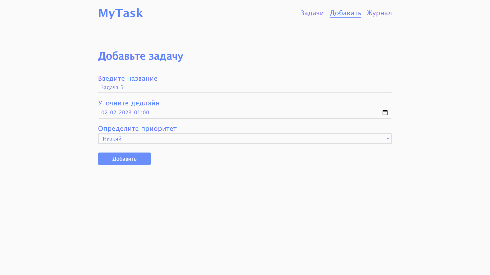

# MyTask

ToDo list для повышения продуктивности.
Доступна продвинутая работа с данными. При добавлении новой задачи можно уточнить дедлайн. А также задачу можно  отметить как выполненное. Интуитивно-понятный дизайн для пользователя, а также надежная работа функий прриложения получены благодаря, инкапсулированному коду. Метод декомпозоции, то бишь, разделения приложения на отдельные компоненты позволяют с легкостью расширять или урезать функционал приложения. 

[Просмотр (версия 2)](https://rasuliazamat.github.io/mytask/)

    
    

---

### Версия 1.1
-   Автоизменение состояния задачи в базе данных
-   Фильтрация по выполненности задачи  
-   Убрана функция показа точного времени (часы, минуты, секунды)
-   Изменен внешний вид и анимация кнопки меню
-   Исправлены мелкие баги и недоработки
### Версия 1

-   Различные манипуляции c данными и сервером:
    **добавление данных, хранение в базе данных и удалениe из базы данных**
-   В качестве базы данных использована **FireBase**
    А **localStorage** используется для хранения выполненных задач
-   **Декомпозиция** на независимые компонентов
-   Эмуляция **SPA** при переключении между ссылками
-   Стек `HTML, CSS, JavaScript, FireBase`
